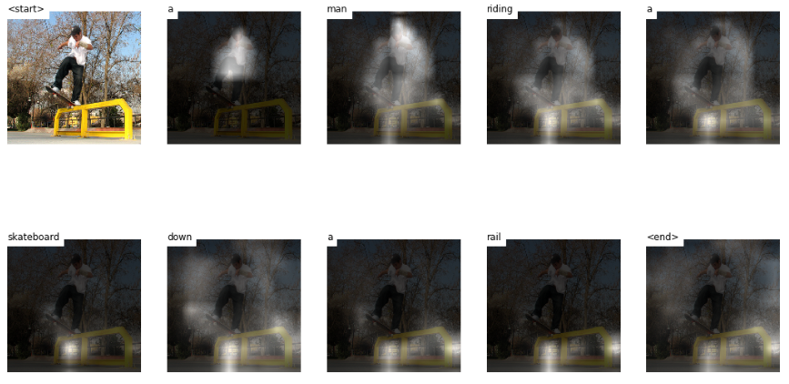

# Deep-Image-Captioning
Image Captioning with Attention : An implementation of Show, Attend and Tell

Description
===========

This is a project on Image Captioning with Deep Learning developed by team Zapdos composed of Abhishek Yadav, Amol Sakhale, Apoorva Gokhale and Chaitanya Patil.
We perform experiments on an implementation of Show, Attend and Tell.

Requirements
============
Install the required packages as follow:
$ pip install -r requirements.txt

Code organization
=================
- /Experiment_Notebooks/Demo_CaptionOutput_resnet101_with_finetune.ipynb -- Run a demo of our code (reproduces Figure 3 of our report)

- /Experiment_Notebooks/train_resnet18.ipynb -- Run the training of our model (as described in Section 2)

- models.py -- Module implementing the classes for the Encoder, Decoder and Attention Mechanism

- utils.py -- Module implementing several utility functions for saving checkpoints, creating input data in HDF5 format, creating the vocabulary and tracking performance metrics

Drive Link to Saved Logs of Experiments Run, Model Checkpoints and Other Assets : https://drive.google.com/drive/folders/11z3UJ9NCBScFb8z3TbfQDEX7FX_5RxYV?usp=sharing

